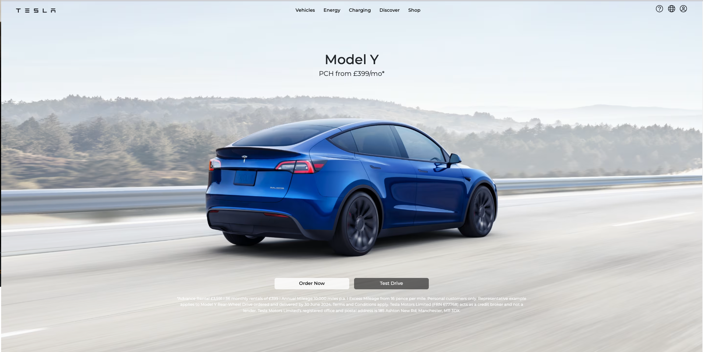
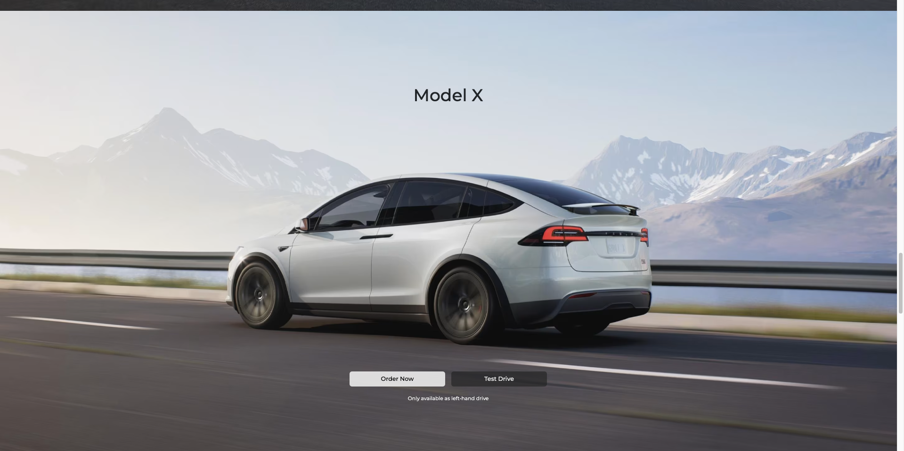
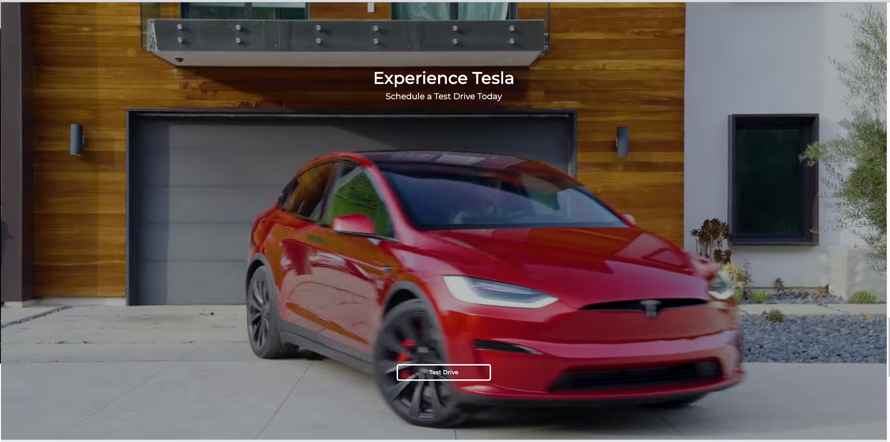
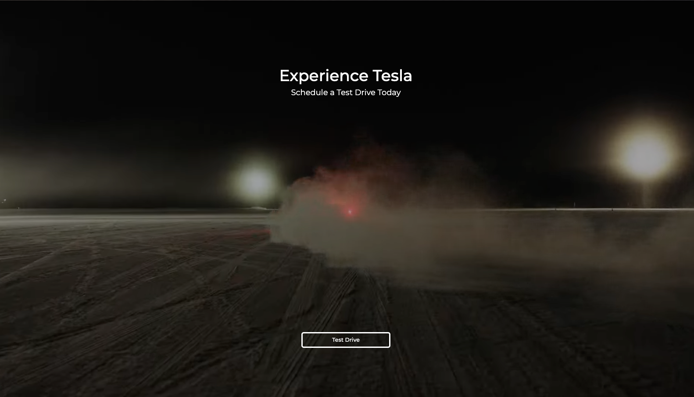
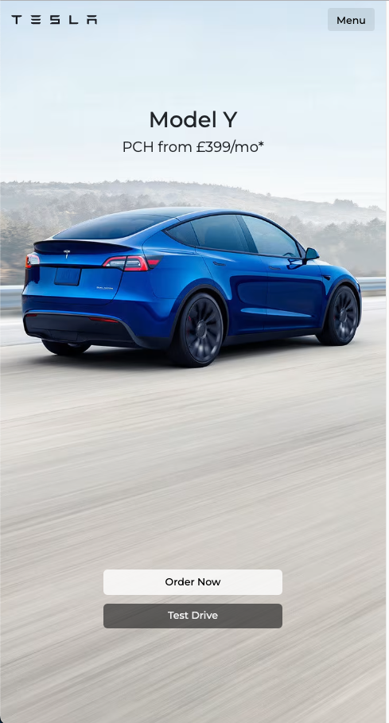
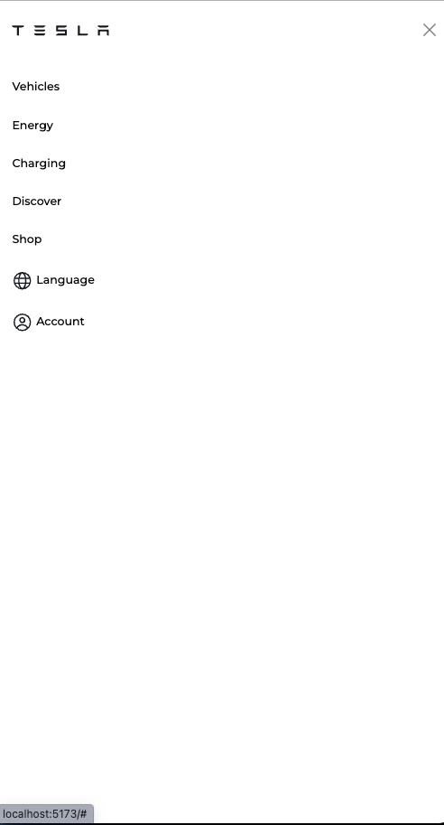
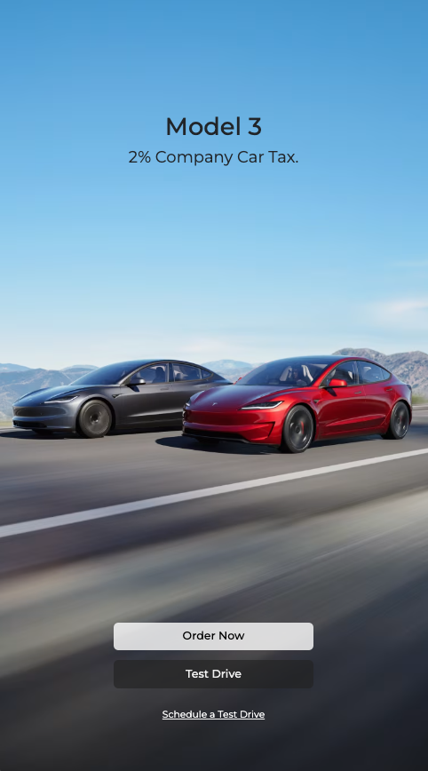
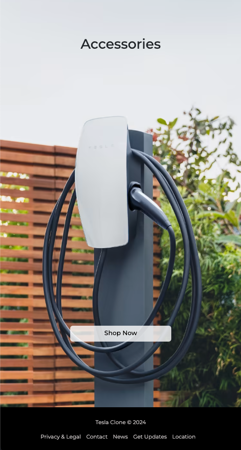

# Tesla Landing Page Clone

This repository contains the source code for a clone of the Tesla landing page as of May 2024. The application is built using Vue 3 and is fully responsive on both desktop and mobile devices. The project utilizes PrimeVue and Bootstrap for UI components and styling.

## Overview

The purpose of this project is to replicate the Tesla landing page, capturing its look and feel as closely as possible as it appeared in May 2024. The website is designed to be fully responsive, adjusting seamlessly to both desktop and mobile viewports. All content is dynamically rendered using reusable Vue components, enhancing maintainability and scalability.

### Desktop






### Mobile






## Features

- **Responsive Design:** The clone is responsive, making it accessible on a wide range of devices from desktops to mobile phones.
- **Dynamic Content Rendering:** Uses Vue 3's composition API to render content dynamically.
- **Reusable Components:** Utilizes reusable Vue components for efficient code management and consistency.
- **Modern UI:** Styled with Bootstrap and PrimeVue for a modern and attractive interface.

## Technologies Used

- **Vue 3:** A progressive JavaScript framework for building user interfaces.
- **PrimeVue:** A rich set of UI components for Vue.
- **Bootstrap:** An open-source toolkit for developing with HTML, CSS, and JS.
- **CSS:** For custom styling.

## Project Setup

To get the project up and running on your local machine, follow these steps:

```bash
# Clone the repository
git clone https://github.com/yourusername/tesla-landing-page-clone.git

# Navigate into the project directory
cd tesla-landing-page-clone

# Install dependencies
npm install

# Serve with hot reload at localhost:8080
npm run serve
```

## Disclaimer: 

This website is designed as an educational project and serves as a clone of Tesla's official site as of May 7, 2024. It is not affiliated with, sponsored by, or endorsed by Tesla, Inc. All content, trademarks, and logos used here are for educational purposes only and remain the property of their respective owners. This site is intended to demonstrate web development skills and is not meant for commercial use or to mislead visitors regarding its affiliation with the Tesla brand.